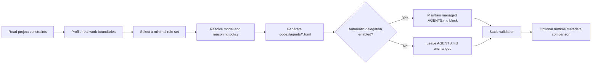

# Generate Project Subagents

[English](README.md) | [简体中文](README.zh-CN.md)

`generate-project-subagents` is a community Codex Skill that turns the real
structure and conventions of a repository into a small set of persistent,
project-scoped custom agents. It generates `.codex/agents/*.toml` files and can
install a conditional automatic-delegation policy in the project `AGENTS.md`.

It does not replace Codex's subagent runtime. Codex still spawns, steers, waits
for, and collects subagent work. This Skill is the project-aware configuration,
routing-policy, and validation layer around that official runtime.

> **Status: Alpha.** The generation and static-validation workflows are ready
> for testing and early adoption. Runtime verification remains dependent on
> metadata exposed by the active Codex client or launcher.

> This is a community project and is not affiliated with or endorsed by OpenAI.

## Why this project exists

Codex already supports built-in subagents and project custom-agent files. The
remaining setup work is project-specific: deciding which roles are genuinely
useful, separating read and write scopes, choosing appropriate models and
reasoning levels, encoding when the parent should delegate, and checking that
the resulting files are internally consistent.

Doing this manually is easy for one agent and surprisingly repetitive for a
real repository. Generic role packs also tend to create too many agents, copy
the same instructions into every role, or assign overlapping write scopes.

This Skill addresses that gap by deriving the role set from repository evidence:

- existing `AGENTS.md`, README, and contribution guidance;
- manifests, frameworks, package managers, and validation commands;
- source, test, documentation, infrastructure, and generated-code boundaries;
- frontend/backend, client/API, service/package, or other ownership surfaces;
- existing `.codex/config.toml` and `.codex/agents/*.toml` files.

The result is intended to be small, explainable, reviewable, and reusable by
future Codex tasks in the same project.

## What it does

- Builds a focused profile of the current repository.
- Generates only roles supported by distinct, repeatable project work.
- Creates project custom-agent files under `.codex/agents/`.
- Supports official role-based defaults, a user-wide default, and per-agent
  model/reasoning overrides.
- Gives read-heavy roles a narrow, evidence-oriented posture and separates
  write-capable workers by ownership boundary.
- Optionally maintains a marked automatic-delegation section in root
  `AGENTS.md` without rewriting user-authored content outside that section.
- Preserves existing custom-agent files unless the user authorizes an update.
- Validates TOML structure, unique role names, model capability declarations,
  delegation references, and optional externally captured runtime metadata.

## What it does not do

- It does not implement or replace Codex's subagent runtime.
- It does not itself spawn, steer, stop, or collect subagents.
- A generated TOML file does not automatically launch an agent.
- The delegation policy is conditional guidance, not a guarantee that every
  matching task will create a subagent thread.
- It does not create roles merely because a task is large or complicated.
- It does not edit application code, credentials, CI secrets, or production
  settings as part of agent generation.
- It does not claim effective runtime model, reasoning, sandbox, token, or quota
  information when the active launcher does not expose independent evidence.

## Requirements

- A current local Codex client with Skills and subagents support.
- Python 3.11 or newer for the bundled validator (`tomllib` is used).
- Git is recommended for repository discovery and reviewing generated changes.

The Skill and validator have no third-party runtime dependencies.

## Installation

### Option 1: clone directly into the Codex Skills directory

```bash
mkdir -p ~/.codex/skills
git clone https://github.com/wanweiLab/generate-project-subagents.git \
  ~/.codex/skills/generate-project-subagents
```

The installed path must contain `SKILL.md` directly at its root:

```text
~/.codex/skills/generate-project-subagents/SKILL.md
```

Refresh or restart Codex if the Skill does not appear immediately.

To update an existing installation:

```bash
git -C ~/.codex/skills/generate-project-subagents pull --ff-only
```

### Option 2: install from an existing checkout

Clone the repository anywhere, then copy the repository directory to
`~/.codex/skills/generate-project-subagents/`. Keep `SKILL.md`, `references/`,
`scripts/`, and `agents/` together; they are all part of the Skill package.

## Quick start

Open the target repository in Codex and ask:

```text
Use $generate-project-subagents to generate project agents for this repository.
```

The default `apply` mode generates agent TOML files and installs the managed
automatic-delegation policy. You can request either of the other modes directly:

```text
Use $generate-project-subagents in preview mode. Show the proposed roles,
model choices, validation results, and AGENTS.md diff without changing files.
```

```text
Use $generate-project-subagents in toml-only mode. Generate the custom-agent
files, but do not modify AGENTS.md.
```

| Mode | Repository analysis | Writes agent TOML | Writes managed `AGENTS.md` policy |
| --- | :---: | :---: | :---: |
| `preview` | Yes | No | No |
| `apply` | Yes | Yes | Yes, unless explicitly disabled |
| `toml-only` | Yes | Yes | No |

## Core workflow



In more detail:

1. **Select a mode.** Resolve `preview`, `apply`, or `toml-only` before writes.
2. **Inspect focused evidence.** Read project guidance, manifests, tests, CI,
   important directory boundaries, and existing Codex configuration.
3. **Choose the smallest useful role set.** Start with read-heavy exploration
   where justified, then add reviewers, test/debug roles, or domain workers only
   when their mission, tools, evidence, or write scope materially differs.
4. **Resolve model policy.** Apply user overrides first, otherwise use the
   current official role-oriented model and reasoning strategy.
5. **Generate constraints.** Each TOML contains a stable name, a routing
   description, focused developer instructions, and only the optional session
   settings justified by the role.
6. **Install conditional routing.** In `apply` mode, maintain only the marked
   delegation block in root `AGENTS.md` and reference exact generated role names.
7. **Validate.** Check the declarations, role references, optional capability
   catalog, and optional runtime report before handing the result back.

## Design principles

### Evidence-driven roles

A role must be supported by repository structure or repeatable work. The Skill
does not generate frontend, backend, security, or documentation agents just to
make the role list look complete.

### Minimal role set

Two roles should remain separate only when their instructions, evidence,
tooling, validation loop, or ownership boundary differs materially. Smaller
role sets are easier for the parent to route and for maintainers to review.

### Least privilege

Explorers and reviewers should be read-only when possible. Write-capable roles
receive explicit ownership boundaries and validation expectations. A TOML
sandbox value is treated as a declaration, not proof of effective permission.

### Disjoint parallel writes

Parallel workers should not edit the same files or ownership surface. The
parent agent remains responsible for integration, conflict resolution, and
project-wide validation.

### Managed, reversible policy

Automatic delegation is installed only inside this marker pair:

```md
<!-- BEGIN generate-project-subagents: delegation-policy -->
...
<!-- END generate-project-subagents: delegation-policy -->
```

Re-running the Skill replaces only that block. User-authored content outside it
is preserved. `toml-only` mode leaves `AGENTS.md` untouched.

### Preserve user-owned configuration

Existing custom-agent files are not overwritten by default. The Skill shows the
proposed update and requires authorization before changing a matching file.

### Honest verification

Configuration is reported in three distinct states:

1. **Declared:** the TOML parses and contains the expected value.
2. **Role-bound:** the launcher selected the exact custom-agent `name` or path.
3. **Effective:** independent runtime metadata confirms the applied model,
   reasoning effort, and sandbox.

The Skill never upgrades “declared” to “effective” based only on the child
thread appearing in the UI or on the child repeating its own instructions.

## Official Codex subagents vs. this Skill

The two layers are complementary:

| Area | Official Codex capability | This Skill |
| --- | --- | --- |
| Runtime | Spawns, steers, waits for, stops, and collects agents | Does not implement runtime orchestration |
| Built-in roles | Provides `default`, `worker`, and `explorer` | Designs narrow project-specific roles when evidence supports them |
| Custom agents | Loads personal `~/.codex/agents/*.toml` and project `.codex/agents/*.toml` | Analyzes a repository and generates/updates project TOML files |
| Model and reasoning | Resolves inheritance, defaults, spawn values, and custom-agent configuration | Chooses what to declare using official strategy plus user overrides |
| Delegation trigger | Delegates after a direct request or applicable project/Skill instruction | Can install persistent, conditional project routing instructions |
| Project analysis | Handles the current task at runtime | Performs a dedicated pass to identify reusable role boundaries |
| Safety boundaries | Enforces the active host, approval, and sandbox behavior | Generates least-privilege declarations and checks for mismatches when evidence exists |
| Validation | Determines actual runtime behavior | Provides static validation and optional runtime-report comparison |
| Token/quota reporting | Subagent work consumes additional tokens; exposed telemetry depends on the product surface | Does not estimate or invent per-agent tokens, account quota, or unavailable telemetry |

In short: **Codex is the execution layer; this Skill is a project-aware authoring
and policy layer.** You can use official subagents without this Skill. Use this
Skill when you want a reproducible set of repository-specific roles and routing
rules instead of designing and maintaining those files by hand.

For the source-of-truth runtime behavior and schema, see the official
[Codex Subagents documentation](https://learn.chatgpt.com/docs/agent-configuration/subagents).

## Generated project layout

The actual roles depend on project evidence. A generated result may look like:

```text
project/
├── .codex/
│   └── agents/
│       ├── project-explorer.toml
│       ├── backend-worker.toml
│       └── reviewer.toml
└── AGENTS.md
```

Each custom-agent file must contain:

```toml
name = "reviewer"
description = "Review completed changes for correctness, regressions, and test gaps."
developer_instructions = """
Review as a read-only project owner. Lead with evidence, cite files and symbols,
and return findings, validation results, and unresolved risks to the parent.
"""
```

Optional values such as `model`, `model_reasoning_effort`, `sandbox_mode`,
`mcp_servers`, and `skills.config` are added only when justified.

## Model and reasoning policy

### User customization

Users can set a default and override individual roles:

```text
Use $generate-project-subagents with this model policy:
- default: gpt-5.6-terra / medium
- reviewer: gpt-5.6 / high
- project_explorer: inherit
```

Equivalent natural-language instructions are supported. `inherit` or `auto`
means the corresponding fields are omitted so normal Codex inheritance applies.
Partial overrides are valid: a user may pin only a model or only a reasoning
effort.

### Generation-time order

The Skill decides what to write into each TOML in this order:

1. explicit per-agent user override;
2. explicit user default;
3. official role-based recommendation encoded by this Skill;
4. omitted fields only when the user requests `inherit`, `auto`, dynamic
   selection, or no pinning.

This is an authoring policy, not Codex's runtime precedence.

### Runtime precedence

Codex first resolves a base value for each setting:

1. explicit spawn value;
2. corresponding `[agents]` default;
3. parent session value.

It then applies the selected custom-agent TOML. A `model` or
`model_reasoning_effort` present in that file overrides the corresponding base
value. Therefore, a spawn override cannot replace a value pinned in the selected
custom-agent file. If the file sets only `model`, the previously resolved
reasoning effort is preserved and must be supported by that model.

Before writing a pin, the Skill checks the active model capability catalog when
one is available. Unsupported user-selected values are reported rather than
silently replaced. Without a catalog, support is labeled unverified.

See [the local schema reference](references/custom-agent-schema.md) for the full
field and inheritance rules.

## Automatic delegation behavior

Agent TOML files define available roles; they do not trigger themselves. The
managed `AGENTS.md` policy tells future parent agents when to consider them:

- skip delegation for trivial, single-file, or conversational work;
- use an explorer first for broad or ambiguous repository work, when available;
- parallelize independent domain workers only when write scopes are disjoint;
- use the exact custom-agent TOML `name` when a task matches that role;
- review write-capable work with a reviewer when one exists;
- wait for requested subagents before final integration;
- let direct user instructions override the policy.

This is model-led conditional routing. An applicable instruction allows Codex
to delegate without the user naming an agent in every prompt, but it does not
force a subagent to start for every eligible task.

## Validation

Validate a generated project:

```bash
python3 scripts/validate_generated_agents.py /absolute/path/to/project
```

Require a model capability catalog:

```bash
python3 scripts/validate_generated_agents.py /absolute/path/to/project \
  --capabilities /absolute/path/to/capabilities.json \
  --require-capabilities
```

Compare independently captured runtime metadata:

```bash
python3 scripts/validate_generated_agents.py /absolute/path/to/project \
  --runtime-report /absolute/path/to/runtime.json \
  --require-runtime-report
```

Static validation proves declarations and references, not that Codex spawned a
role or applied its settings. See
[runtime verification](references/runtime-verification.md) for the evidence
levels and report format.

## Development

Run the test suite:

```bash
python3 -m unittest discover -s tests -v
```

Run Python syntax checks:

```bash
python3 -m compileall -q scripts tests
```

See [CONTRIBUTING.md](CONTRIBUTING.md) for contribution expectations and
[CHANGELOG.md](CHANGELOG.md) for release notes.

## Known limitations

- Role design is model-led and evidence-driven, not a deterministic repository
  classifier; generated changes should still be reviewed.
- Model availability and supported reasoning levels vary by Codex environment.
- Runtime role/model/reasoning/sandbox verification is only possible when the
  launcher or host exposes independent metadata.
- Per-subagent token usage, account quota, and remaining allowance are not
  inferred when the product surface does not expose authoritative telemetry.
- Automatic delegation depends on applicable instructions and Codex runtime
  judgment; it is intentionally not an “always spawn” switch.

## License

Released under the [MIT License](LICENSE).
