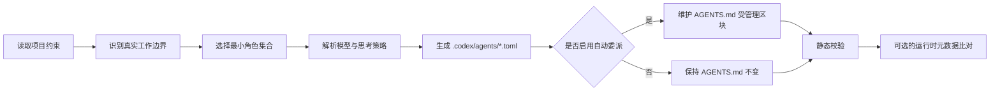

# 自动生成项目子 Agents

[English](README.md) | [简体中文](README.zh-CN.md)

`generate-project-subagents` 是一个社区 Codex Skill。它会根据仓库的真实
结构、技术栈和项目约束，生成一组少量、持久、项目级的自定义子 agent，
对应文件位于 `.codex/agents/*.toml`；还可以在项目根目录 `AGENTS.md` 中
安装一段条件式自动委派策略。

它不会替代 Codex 的子 agent 运行时。子 agent 的启动、引导、等待、停止和
结果汇总仍由 Codex 负责。本 Skill 提供的是围绕官方运行时的项目分析、配置
生成、路由策略和校验层。

> **当前状态：Alpha。** 配置生成与静态校验流程已经适合测试和早期使用；
> 运行时是否实际加载了指定角色、模型、思考等级和沙箱，仍取决于当前 Codex
> 客户端或 launcher 是否提供可独立核验的元数据。

> 本项目是社区项目，与 OpenAI 无隶属关系，也未获得 OpenAI 官方背书。

## 项目背景

Codex 官方已经支持内置子 agent 和项目级 custom-agent TOML。真正费时间的
往往不是“有没有子 agent”，而是如何结合具体项目完成这些配置工作：

- 这个仓库到底需要哪些长期可复用的角色；
- 哪些角色只读，哪些角色可以写，写入范围如何避免重叠；
- 不同角色应该使用什么模型和思考等级；
- 主 agent 在什么条件下应该自动委派；
- 生成后的 TOML、角色引用和运行时证据如何校验。

手工配置一个角色并不困难，但在真实项目中反复维护会变得繁琐。通用角色包
又容易生成过多 agent、把同一套说明复制到每个角色，或者让多个写入型 agent
修改同一片代码。

本 Skill 通过项目证据来设计角色，而不是套用固定角色清单。它会重点检查：

- 现有 `AGENTS.md`、README 和贡献指南；
- 清单文件、框架、包管理器、构建和测试命令；
- 源码、测试、文档、基础设施和生成代码边界；
- 前后端、客户端/API、服务/包等真实所有权边界；
- 已有 `.codex/config.toml` 和 `.codex/agents/*.toml`。

最终结果应该是少量、可解释、可审查，并且能被后续 Codex 任务持续复用的
项目角色。

## 能做什么

- 为当前仓库建立一份聚焦的项目画像。
- 只生成有独立、可重复工作边界支撑的角色。
- 在 `.codex/agents/` 下创建项目级 custom-agent TOML。
- 支持官方角色策略、用户统一默认值，以及每个 agent 独立的模型和思考等级
  覆盖。
- 让读取型角色保持证据导向和窄权限，并按所有权边界拆分写入型角色。
- 可在根 `AGENTS.md` 中维护一个带标记的自动委派区块，不改写区块外的用户
  内容。
- 默认保留已有 custom-agent 文件，除非用户明确授权更新。
- 校验 TOML 结构、角色名称唯一性、模型能力声明、委派引用，以及可选的外部
  运行时元数据。

## 不做什么

- 不实现、也不替代 Codex 子 agent 运行时。
- 不直接负责 spawn、steer、stop、wait 或 collect。
- 只生成 TOML 不会自动启动 agent。
- 自动委派策略是条件式指导，不保证每个匹配任务都一定创建子 agent 线程。
- 不会仅仅因为任务很大或很复杂就创建新角色。
- 生成 agent 时不会修改业务代码、凭据、CI 密钥或生产配置。
- 当 launcher 没有提供独立证据时，不会声称已经确认实际模型、思考等级、
  沙箱、token 消耗或账号额度。

## 环境要求

- 当前版本的本地 Codex 客户端，并支持 Skills 与 subagents。
- Python 3.11 或更高版本，用于运行内置校验器（使用 `tomllib`）。
- 推荐安装 Git，用于识别仓库根目录和审查生成变更。

Skill 和校验器没有第三方运行时依赖。

## 安装方式

### 方式一：直接克隆到 Codex Skills 目录

```bash
mkdir -p ~/.codex/skills
git clone https://github.com/wanweiLab/generate-project-subagents.git \
  ~/.codex/skills/generate-project-subagents
```

安装后的目录根部必须直接包含 `SKILL.md`：

```text
~/.codex/skills/generate-project-subagents/SKILL.md
```

如果 Skill 没有立即出现在 Codex 中，请刷新或重启 Codex。

更新已有安装：

```bash
git -C ~/.codex/skills/generate-project-subagents pull --ff-only
```

### 方式二：从已有代码目录安装

也可以把仓库克隆到任意位置，再将整个仓库目录复制到
`~/.codex/skills/generate-project-subagents/`。请一起保留 `SKILL.md`、
`references/`、`scripts/` 和 `agents/`，它们都属于 Skill 包的一部分。

## 快速开始

在 Codex 中打开目标项目，然后输入：

```text
使用 $generate-project-subagents，为当前仓库生成项目子 agents。
```

默认使用 `apply` 模式：生成 agent TOML，并安装受管理的自动委派策略。也可以
直接指定另外两种模式：

```text
使用 $generate-project-subagents 的 preview 模式。展示建议角色、模型选择、
校验结果和 AGENTS.md diff，但不要修改任何文件。
```

```text
使用 $generate-project-subagents 的 toml-only 模式。只生成 custom-agent
文件，不要修改 AGENTS.md。
```

| 模式 | 分析仓库 | 写入 agent TOML | 写入受管理的 `AGENTS.md` 策略 |
| --- | :---: | :---: | :---: |
| `preview` | 是 | 否 | 否 |
| `apply` | 是 | 是 | 是，除非用户明确关闭 |
| `toml-only` | 是 | 是 | 否 |

## 核心流程



具体分为七步：

1. **确定模式。** 在写文件之前确认使用 `preview`、`apply` 或
   `toml-only`。
2. **读取聚焦证据。** 检查项目说明、清单、测试、CI、关键目录边界和已有
   Codex 配置，不把整个仓库无差别塞入上下文。
3. **选择最少且有用的角色。** 有充分结构时先考虑读取型 explorer；只有在
   任务目标、工具、证据或写入范围确实不同的情况下，才增加 reviewer、
   test/debug 或领域 worker。
4. **确定模型策略。** 用户自定义优先；否则采用 Skill 中编码的当前官方角色
   模型与思考等级策略。
5. **生成约束文件。** 每个 TOML 都包含稳定名称、路由描述、聚焦的 developer
   instructions，以及该角色真正需要的可选会话设置。
6. **安装条件式路由。** `apply` 模式下，只维护根 `AGENTS.md` 中带标记的
   委派区块，并使用生成角色的准确名称。
7. **执行校验。** 在交付前检查声明、角色引用、可选模型能力目录和可选运行时
   报告。

## 设计方式

### 由证据决定角色

角色必须由仓库结构或可重复工作支撑。Skill 不会为了让清单看起来完整，就
固定生成前端、后端、安全或文档 agent。

### 保持最小角色集合

只有当任务说明、证据、工具、验证循环或所有权边界存在实质差异时，两个角色
才值得分开。更少的角色更容易让主 agent 正确路由，也更容易由维护者审查。

### 最小权限

explorer 和 reviewer 应尽量只读。写入型角色必须有明确的目录或所有权边界，
并包含对应验证要求。TOML 中的 sandbox 值只是声明，不能单独证明运行时真实
权限。

### 并行写入互不重叠

并行 worker 不应编辑相同文件或相同所有权区域。最终整合、冲突处理和项目级
验证仍由主 agent 负责。

### 策略可控、可逆

自动委派策略只写入以下标记之间：

```md
<!-- BEGIN generate-project-subagents: delegation-policy -->
...
<!-- END generate-project-subagents: delegation-policy -->
```

再次运行 Skill 时只替换这个区块，区块外的用户内容保持不变。`toml-only`
模式完全不修改 `AGENTS.md`。

### 保护用户配置

已有 custom-agent 文件默认不会被覆盖。命中现有文件时，Skill 应先展示准备
修改的内容，并在获得授权后再更新。

### 不夸大验证结果

配置结果分为三个不同状态：

1. **declared（已声明）：** TOML 能解析，并包含预期字段。
2. **role-bound（已绑定角色）：** launcher 报告选择了准确的 custom-agent
   `name` 或路径。
3. **effective（已确认生效）：** 独立运行时元数据确认实际使用的模型、思考
   等级和 sandbox。

仅看到页面上出现子 agent 线程，或子 agent 自己复述配置，都不能把
“declared”升级成“effective”。

## 与 Codex 官方子 agent 能力的区别

两者是互补关系，不是替代关系：

| 维度 | Codex 官方能力 | 本 Skill |
| --- | --- | --- |
| 运行时 | 负责启动、引导、等待、停止和汇总 agents | 不实现运行时编排 |
| 内置角色 | 提供 `default`、`worker`、`explorer` | 根据项目证据设计窄职责的专用角色 |
| 自定义 agent | 加载个人级 `~/.codex/agents/*.toml` 和项目级 `.codex/agents/*.toml` | 分析仓库并生成或更新项目 TOML |
| 模型与思考 | 解析继承、全局默认、spawn 参数和 custom-agent 配置 | 按官方策略和用户覆盖决定 TOML 声明内容 |
| 委派触发 | 根据用户直接要求或适用的项目/Skill 指令执行委派 | 可安装持久、条件式项目路由指令 |
| 项目分析 | 运行时围绕当前任务处理 | 专门分析可长期复用的角色边界 |
| 安全边界 | 由当前 host、approval 和 sandbox 决定实际行为 | 生成最小权限声明，并在有证据时检查偏差 |
| 校验 | 决定实际运行行为 | 提供静态校验和可选运行时报告比对 |
| Token/额度 | 子 agent 会额外消耗 token；遥测是否可见取决于产品界面 | 不估算或虚构单 agent token、账号额度和不可用遥测 |

一句话概括：**Codex 是执行层，本 Skill 是项目感知的配置生成与路由策略层。**
不安装本 Skill 也可以直接使用官方子 agents；当你希望持久保存一套仓库专用
角色和路由规则，而不是手工反复设计和维护 TOML 时，再使用本 Skill。

运行机制和 schema 的最终事实来源，请以官方
[Codex Subagents 文档](https://learn.chatgpt.com/docs/agent-configuration/subagents)
为准。

## 生成后的项目结构

实际角色取决于项目证据，可能类似：

```text
project/
├── .codex/
│   └── agents/
│       ├── project-explorer.toml
│       ├── backend-worker.toml
│       └── reviewer.toml
└── AGENTS.md
```

每个 custom-agent 文件必须包含：

```toml
name = "reviewer"
description = "Review completed changes for correctness, regressions, and test gaps."
developer_instructions = """
Review as a read-only project owner. Lead with evidence, cite files and symbols,
and return findings, validation results, and unresolved risks to the parent.
"""
```

`model`、`model_reasoning_effort`、`sandbox_mode`、`mcp_servers` 和
`skills.config` 等可选设置，只在项目证据与角色需要能够支持时才添加。

## 模型与思考等级策略

### 用户自定义

用户可以指定统一默认值，也可以单独覆盖某个角色：

```text
使用 $generate-project-subagents，并采用下面的模型策略：
- default: gpt-5.6-terra / medium
- reviewer: gpt-5.6 / high
- project_explorer: inherit
```

等价的自然语言说明同样有效。`inherit` 或 `auto` 表示省略对应字段，让 Codex
按正常规则继承。也支持部分覆盖：只固定模型，或者只固定思考等级。

### 生成时优先级

Skill 按下面顺序决定每个 TOML 写入什么：

1. 用户对单个 agent 的明确覆盖；
2. 用户设置的统一默认值；
3. Skill 中编码的官方角色推荐策略；
4. 只有用户要求 `inherit`、`auto`、动态选择或不固定时，才省略对应字段。

这是配置生成策略，不是 Codex 的运行时优先级。

### 运行时优先级

Codex 会先为每个设置解析基础值：

1. 显式 spawn 值；
2. 对应的 `[agents]` 默认值；
3. 父会话值。

随后再应用选中的 custom-agent TOML。文件中存在的 `model` 或
`model_reasoning_effort` 会覆盖对应基础值。因此，spawn 参数不能覆盖已经在
该 custom-agent 文件中固定的值。如果文件只设置了 `model`，则保留此前解析
出的思考等级，并且该模型必须支持这个等级。

写入固定值之前，如果环境提供模型能力目录，Skill 会先检查模型名称和支持的
思考等级。用户指定的不支持值会被明确报告，不会被静默替换；无法获取能力
目录时，会标记为“未验证支持”。

完整字段与继承规则见[本地 schema 参考](references/custom-agent-schema.md)。

## 自动委派如何生效

Agent TOML 只定义可用角色，本身不会触发运行。受管理的 `AGENTS.md` 策略会
告诉后续主 agent 何时应该考虑使用这些角色：

- 简单、单文件或纯对话任务不委派；
- 范围宽或含糊的仓库任务，在有 explorer 时先让它探索；
- 只有写入范围互不重叠时，才并行运行领域 worker；
- 任务匹配某个角色时，使用其 TOML 中准确的 `name`；
- 存在 reviewer 时，对写入型任务进行复核；
- 等待请求的子 agents 完成后，再由主 agent 最终整合；
- 用户的直接指令优先于自动委派策略。

这是一种由模型判断的条件式路由。适用的项目指令可以让 Codex 在用户没有每次
点名 agent 的情况下发起委派，但不会强制每个符合条件的任务都启动子 agent。

## 校验方式

校验生成后的项目：

```bash
python3 scripts/validate_generated_agents.py /absolute/path/to/project
```

要求提供模型能力目录：

```bash
python3 scripts/validate_generated_agents.py /absolute/path/to/project \
  --capabilities /absolute/path/to/capabilities.json \
  --require-capabilities
```

比对独立采集的运行时元数据：

```bash
python3 scripts/validate_generated_agents.py /absolute/path/to/project \
  --runtime-report /absolute/path/to/runtime.json \
  --require-runtime-report
```

静态校验只能证明声明和引用正确，不能证明 Codex 已经启动了某个角色或应用了
其中设置。证据等级和报告格式见
[运行时验证说明](references/runtime-verification.md)。

## 开发与测试

运行测试套件：

```bash
python3 -m unittest discover -s tests -v
```

执行 Python 语法检查：

```bash
python3 -m compileall -q scripts tests
```

贡献要求见 [CONTRIBUTING.md](CONTRIBUTING.md)，版本记录见
[CHANGELOG.md](CHANGELOG.md)。

## 已知限制

- 角色设计由模型结合项目证据完成，不是确定性的仓库分类器；生成内容仍应由
  使用者审查。
- 不同 Codex 环境可用的模型和思考等级可能不同。
- 只有 launcher 或 host 暴露独立元数据时，才能核实实际角色、模型、思考
  等级和 sandbox。
- 当产品界面没有提供权威遥测时，不推断单个子 agent 的 token 消耗、账号额度
  或剩余额度。
- 自动委派依赖适用指令和 Codex 运行时判断，设计上就不是“始终启动”的开关。

## 许可证

本项目使用 [MIT License](LICENSE)。
